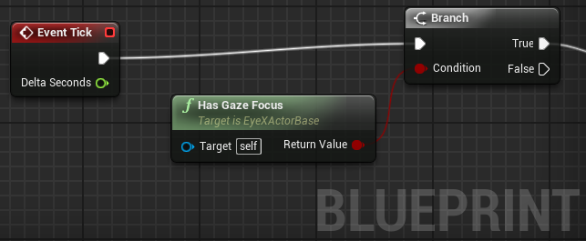

---

Developer's Guide - Tobii EyeX SDK for Unreal Engine 4
======================================================

---
**The Tobii EyeX Software Development Kit (SDK) for Unreal Engine 4 contains everything you need for building games using the Tobii EyeX Engine API and the Tobii EyeX plugin for Unreal Engine 4.**

---
Last updated: January 22, 2016

Images © 2016 Tobii AB (publ) - All rights reserved. Tobii and the Tobii logos are either registered trademarks or trademarks of Tobii in the United States and/or other countries.
[www.tobii.com](http://www.tobii.com)

## Table of Contents
- [Introduction](#introduction)
- [Getting started](#getting-started)
  - [How to set up the development environment](#how-to-set-up-the-development-environment)
  - [Sample scenes](#sample-scenes)
  - [Where to go from here](#where-to-go-from-here)
- [Your game and the Tobii EyeX environment](#your-game-and-the-tobii-eyex-environment)
- [Overview of the EyeX Engine API](#overview-of-the-eyex-engine-api)
  - [The Gaze point data stream](#the-gaze-point-data-stream)
  - [The Eye position data stream](#the-eye-position-data-stream)
  - [The Fixation data stream](#the-fixation-data-stream)
  - [The User presence state](#the-user-presence-state)
- [Using the EyeX Plugin for Unreal Engine](#using-the-eyex-plugin-for-unreal-engine)
  - [Using EyeX Engine data streams and states](#using-eyex-engine-data-streams-and-states)
  - [Detecting actors with eye-gaze interaction ](#detecting-actors-with-eye-gaze-interaction)
    - [Configurable detection strategies](#configurable-detection-strategies)
    - [Using eye-gaze interaction in blueprints](#using-eye-gaze-interaction-in-blueprints)
  - [Mouse emulation](#mouse-emulation)
  - [C++ code sample: Gaze Point data](#c-code-sample-gaze-point-data)
  - [Blueprint sample: Gaze Point data](#blueprint-sample-gaze-point-data)
  - [Blueprint sample: a cube which spins when the player is looking at it](#blueprint-sample-a-cube-which-spins-when-the-player-is-looking-at-it)
- [Building and distributing your game](#building-and-distributing-your-game)

## Introduction
Have you ever wanted to create a game that the player can interact with using her eyes? The EyeX Plugin for Unreal Engine bridges the gap between the Unreal Engine development environment and the Tobii EyeX API and lets you do just that.

The plugin can be inserted into any game built with the Unreal Engine 4.6 or higher and used from both blueprints and C++ code.

Because the plugin depends on the Tobii EyeX Engine, it will only work properly on platforms where the EyeX Engine is supported: currently Windows 7 and later. The plugin includes a mouse emulation function that can be used to do some limited development and testing on other platforms as well.

The EyeX Plugin for Unreal Engine is provided on GitHub under a quite permissive open-source license. You will also need the EyeX client library to use the plugin. It can be downloaded from Tobii free of charge, and it has a permissive (but not open source) license agreement too. Make sure to read the license agreement because it’s not the same as for the plugin itself.

*Note. Tobii provides EyeX SDKs for several other development environments in addition to the Unreal Engine. They are all available for download from the* [Tobii Developer Zone](http://developer.tobii.com).

[&uarr; Back to Table of Contents](#table-of-contents)

## Getting started
You will need:
- The Unreal Engine version 4.6 or later from Epic. You may either download and run the UE installer, or build it yourself from source if you have access to the UE source on GitHub.
- The Tobii EyeX software bundle (can be downloaded here: [www.tobii.com/eyex-setup](http://www.tobii.com/eyex-setup)) and an EyeX Controller (can be bought here: [www.tobii.com/xperience](http://www.tobii.com/xperience)) or other compatible eye tracker. The SteelSeries Sentry works just as well, for example. 
- The Tobii EyeX Plugin for Unreal Engine. Download it from the EyeXforUE4 project on GitHub.
- Microsoft Visual Studio 2013/2015 (Unreal Engine 4.10 and higher requires VS2015).

[&uarr; Back to Table of Contents](#table-of-contents)

## How to set up the development environment

Follow the steps in the README.md file carefully to set up the development environment for EyeX.

After you have completed the setup you should have a working sample “game” with a couple of scenes that demonstrate various usages of the eye tracking data. 

You should also be able to grab the Plugins folder from the sample game and drop it into your own game. And that’s when the real fun starts!

[&uarr; Back to Table of Contents](#table-of-contents)

## Sample scenes
The EyeX Plugin for Unreal Engine package includes not only the plugin itself but also a sample project with a few sample scenes (in the form of levels/maps) that demonstrate how the eye tracking data can be used in a game.

All samples are implemented in the form of blueprints.

*Note. The graphics and gameplay in the sample scenes have been deliberately kept to a minimum so as not to get in the way of the code.*

#### Sample scene: Gaze Interaction
This scene contains a few objects that respond differently to the player’s eye-gaze: the sphere spins around, the rock grows, and the cube turns on a light source when looked at.

Looking at the blueprint you will find that the sphere and the rock trigger their actions using the HasGazeFocus method, while the cube uses the GotGazeFocus/LostGazeFocus events.

Another interesting thing to do in this scene is to select the player controller actor while the level is running in the editor and enable the EyeX/VisualizeDetection property. Doing that will let you see how the hit testing is performed. You can also try different detection modes.

#### Sample scene: Adaptive Depth of Field
This scene contains a couple of objects tossed out at different distances. When you focus on one of them, the rendering updates so that objects that are out of focus (due to the limited depth-of-field) are blurred. This means that the view won’t be perfectly sharp everywhere at the same time. That could have some really interesting uses in a FPS game.

#### Sample scene: Eye Position
This scene visualizes the player’s eyes and the gaze point in 3D. It gives an idea of how the eye positions data stream behaves.

#### Sample scene: User Presence
In this scene the screen is dimmed when no player is present in front of the screen.

#### Sample scene: Fixations
This scene shows how the fixation detection works: it’s a static scene and the fixations are visualized on top.
Fixations are points where the gaze lingers to focus on something. The visualization displays the last few fixations as orange circles and the ongoing fixation (if any) as a gray circle.

#### Sample scene: Gaze Point
This is a scene where the player’s gaze point is visualized on top of the viewport. You can try both the unfiltered and the lightly filtered alternatives and compare them to each other.

[&uarr; Back to Table of Contents](#table-of-contents)

### Where to go from here
We recommend that you browse through the rest of this Developer’s Guide, because it will give you a big picture view of the EyeX Engine and its API. Knowing what the engine can do for you, and how the pieces fit together, will surely be helpful as you move on to create your game.

After that you should be ready to create some eye-gaze interaction yourself! Just remember that the Tobii Developer Zone is there for you if you need inspiration or if you get stuck.

[&uarr; Back to Table of Contents](#table-of-contents) 

## Your game and the Tobii EyeX environment
The figure below gives an overview of the hardware and software components that work together to create the Tobii Eye Experience. By using the EyeX plugin in your game, you can make it possible for the player to interact with the game using her eyes!


*Figure 1 Your game and Tobii EyeX environment. The game is running on the computer screen on the left-hand side. An EyeX Controller is mounted on the screen and is detecting the player’s eye-gaze. The diagram on the right-hand side shows the software running on the computer. The game makes use of the EyeX Engine and Controller through the EyeX Plugin.*

The **EyeX Controller** is a device which can determine what you’re looking at. It is mounted on the bottom of the computer screen and attached to the computer with a USB 3.0 cable.

The **EyeX Engine** takes the data from the EyeX Controller or other compatible device, processes the data, and makes it available to your game and other applications through an API. The EyeX Engine also takes care of all the necessary groundwork when it comes to eye tracker hardware configuration, user calibration, and so on.

The **EyeX Plugin for Unreal Engine** adapts the EyeX API so that it can be used easily in games built using the Unreal Engine.
EyeX Interaction is a way of interacting with the computer in a natural and effortless way based on where you look. This ranges from your computer simply being aware of your presence all the way to clicking and scrolling in apps or games that have implemented EyeX Engine interactions. The box labeled EyeX Interaction in the diagram represents the software that enables this kind of interaction in the Windows environment. It is passive while your game is running.

[&uarr; Back to Table of Contents](#table-of-contents)

## Overview of the EyeX Engine API
The figure below presents an overview of what the EyeX Engine API offers. The EyeX Plugin for Unreal Engine currently does not cover the whole API: the parts that handle regions have been left out because they are not straightforward to implement in a 3D environment. But the plugin does offer an alternative for gaze-aware regions, see the section Detecting actors with eye-gaze interaction for more information.


*Figure 2 A somewhat simplified view of what the EyeX Engine API can do for you.*

[&uarr; Back to Table of Contents](#table-of-contents)

### The Gaze point data stream
The Gaze point data stream represents the user’s gaze point on the screen. The unfiltered data stream produces a new data point whenever the engine receives a valid eye-gaze data point from the eye tracker. No statements are made regarding the frame rate; you get what you get.


*Figure 3: The gaze point is an inherently noisy signal. The orange dots on this screenshot represent the user’s gaze point during a fraction of a second. Filtering makes the point cloud shrink towards its center, but also respond slower to rapid eye movements.*

The gaze point is given as a single point. If the user has chosen to track a specific eye, then it’s the gaze point from that eye. Otherwise the point is taken to be the average from both eyes. 

Because the gaze point is an intrinsically noisy signal, the Gaze point data stream provides a selection of filters that can be used to stabilize the signal. As usual when it comes to filtering, there is a trade-off between stability and responsiveness, so there cannot be a single filter that is the best choice for all applications, but the Lightly filtered option is a reasonable default and works in most cases. The available filters are: 
- **Lightly filtered**: an adaptive filter which is weighted based on both the age of the data points and the velocity of the eye movements. This filter is designed to remove noise while at the same time being responsive to quick eye movements. 
- **Unfiltered**: no filtering performed by the engine. (Except for the removal of invalid data points and the averaging of the gaze points from both eyes.) 

[&uarr; Back to Table of Contents](#table-of-contents)

### The Eye position data stream
The Eye position data stream provides the positions of the user’s eyes in three-dimensional space. This data stream can be used, for example, to control the camera perspective. 

This data stream produces a new value whenever the engine receives a valid sample from the eye tracker, and no statements are made about the frame rate, just as for the Gaze point data stream. The eye positions are given for the left and right eyes individually. 

The Eye position data stream does not offer any filtering options at this time.

##### Good to know about the Eye position data from the EyeX Controller
There are some limitations to the smoothness of the eye position data stream from the EyeX Controller eye tracking device. Any user experience based on the eye position data stream should be designed with these limitations in mind.

First, the distance of the eyes to the eye tracker is not updated while the user is moving her head towards or away from the controller. This means that the eye position will follow smoothly only when moving the eyes and the head at a roughly fixed distance from the screen, like when you are leaning from side to side. The reported eye position will catch up with a jump when the head movement has stopped.

Second, the calculated distance to the eyes may have a user-dependent offset error. So use it only for relative, not absolute positioning – which is a good idea anyway since users will choose to sit at different distances from the screen. 

[&uarr; Back to Table of Contents](#table-of-contents)

### The Fixation data stream
The Fixation data stream provides information about when the user is fixating her eyes at a single location. This data stream can be used to get an understanding of where the user’s attention is. In most cases, when a person is fixating at something for a long time, this means that the person’s brain is processing the information at the point of fixation. If you want to know more about fixations, the Internet is your friend. 

The fixation data stream can be accessed through two functions: one getting the ongoing fixation, if any, and one getting the last finished fixation. Each fixation is presented as a gaze point, a start time, and the duration. 

There are two different fixation detection modes to choose from:
- **Sensitive**: will result in many fixations, sometimes very close and in quick succession. 
- **Slow**: will result in fairly stable fixations but may leave somewhat late. 

[&uarr; Back to Table of Contents](#table-of-contents)

### The User presence state 
The User presence state provides information about whether there is currently a user in front of the screen or not. The state can be “Present”, “Not Present” or “Unknown”. The “Unknown” state occurs when there is no information available, for example when there is no eye tracker connected to the computer.

[&uarr; Back to Table of Contents](#table-of-contents)

## Using the EyeX Plugin for Unreal Engine
The EyeX Plugin for Unreal Engine wraps the functionality of the EyeX Engine C API and adapts it for use with Unreal Engine. What does that mean? Well, for one thing: whereas the EyeX Engine API is multi-threaded and fully asynchronous, the Unreal Engine environment is frame-based (that is, it is updated in discrete “ticks” or frames) and essentially single-threaded. Another thing is that you need to add special markup to functions or data in order to use them from blueprints. The EyeX Plugin for Unreal Engine does these two things and a few other things as well.

*Note. If you want to know how things work under the hood, or if you want to do advanced stuffz that cannot be done with this plugin, then feel free to check out the header documentation for the C API, because this guide doesn’t cover that API. If you’d rather not, like most people, then you can safely ignore it.*

[&uarr; Back to Table of Contents](#table-of-contents)

### Using EyeX Engine data streams and states
All relevant EyeX engine states and data streams can be accessed through accessor (getter) functions, both from blueprints and from C++ code. These functions will always give you the most recent data point of a data stream, or the current value of an engine state.

If you use blueprints, you will find these functions in the EyeX blueprint function library. If you use C++, you will find them in the plugin module interface class: IEyeXPlugin.

In addition to the EyeX Engine data streams and states, there are also some functions for getting derived data that can be useful in gaming scenarios, such as the head rotation (yaw and roll) derived from the eye positions.

Data streams are not subscribed to by default. The subscription is set up the first time you use the accessor function (or the accessor function for a derived value), which means that the EyeX Engine will start sending data at that point. This means that you will never receive a valid value on the first call to the accessor function.

The EyeX Engine states exposed through the plugin API are updated automatically. You can always read from them and they will reflect the most recent value provided by the engine. If the connection to the engine is lost they will be reset to invalid.

The special template class TEyeXMaybeValue is used for values that may or may not be known. For example, the GetScreenBounds method returns a value of type TEyeXMaybeValue<FEyeXScreenBounds>. If no connection to the EyeX Engine has been established, or the EyeX Engine isn’t set up properly, then the returned value will have its bHasValue flag set to false.

[&uarr; Back to Table of Contents](#table-of-contents)

### Detecting actors with eye-gaze interaction
Suppose you have some actors in your scene that should respond to the player’s eye-gaze somehow. The EyeX Plugin for Unreal Engine provides a player controller/actor base class combo that you can use to do exactly that.

The AEyeXPlayerController class derives from the APlayerController class. It is always on the lookout for eye-gaze interactable actors in the viewport: each tick it will try to read the player’s gaze point and find out which actor the player is looking at. It will only consider actors derived from the AEyeXActorBase.

[&uarr; Back to Table of Contents](#table-of-contents)

#### Configurable detection strategies
The EyeX player controller can be configured to use one of several possible detection strategies to decide which actor the player is currently looking at. Some are fast but not very sensitive whereas others are slow but very accurate. The default strategy works in most cases, but if you should find that you need something faster because you have a busy scene, or something more accurate because the eye-gaze interaction is a central part of the gameplay, then we encourage you to experiment. The player controller class has a setting for debug visualization that will let you see the gaze point and the detection results in real time when enabled. (This feature is disabled when building for shipping.) 

**Detection strategy** | **Description**                                                       | **Pros and cons** 
---------------------- | --------------------------------------------------------------------- | -------------------
None                   | Detection is disabled.                                                | (n/a)
Line Trace             | Performs a basic line trace hit testing starting from the gaze point. | Fast, but the actors may have to be surrounded in collision volumes in order to be detected. 
Boxed Line Trace       | Starts with a basic line trace. If no actors are found, does additional line traces in a box shape around the gaze point. | Pretty fast and with a higher detection success rate than a basic line trace.
Sweep                  | Performs hit testing with a sphere swept from the gaze point into the scene. The sweep is performed in segments where the size of the sphere is adjusted in each segment to keep it roughly at a fixed size in 3D world coordinates. | High detection success rate, but more expensive (slow) than the line traces. 
Frustum Intersection   | Calculates a view frustum defined by a box shape around the gaze point in screen space and checks for any actors intersecting with the frustum. | Very accurate, but can be expensive (slow) if the scene contains many EyeXActors with a lot of vertices.

The AEyeXActorBase class has no behavior of its own, but it does have some properties like cutoff distances and dwell times that affect the sensitivity of the detection.

[&uarr; Back to Table of Contents](#table-of-contents)

#### Using eye-gaze interaction in blueprints
To implement eye-gaze interaction with blueprints you need to have a player controller blueprint that inherits from EyeXPlayerController, and create actor blueprints that inherits from EyeXActorBase for every actor you want to interact with in the scene. Make sure the EyeX based player controller is set up as the selected player controller in the game’s default or level game mode.

The EyeXPlayerController keeps track of which actor the player is currently looking at, if any. An actor deriving from EyeXActorBase can get information about if the player is currently looking at it in two ways:

- By listening to the EyeX player controller events GotGazeFocus and LostGazeFocus.
- By listening to the Tick event and using the HasGazeFocus function which returns true or false depending on if the player is looking at the actor or not.

To use any of these events or function in a blueprint, right click in the blueprint graph and type “EyeX” to filter out the eye tracking blueprint nodes.

The detection strategy used by the EyeXPlayerController based blueprint can be changed in the Defaults tab in the blueprint editor.

For examples on how to use eye-gaze interaction in blueprints, see section Blueprint sample: a cube which spins when the player is looking at it, and the implementation of the sample scenes included in the EyeXSamples project.

[&uarr; Back to Table of Contents](#table-of-contents)

### Mouse emulation
The EyeX Plugin for Unreal Engine includes a mouse emulation function which can be useful not only for testing/troubleshooting eye-gaze interaction, but also for game development on platforms where EyeX isn’t available. When enabled, the mouse emulation function will let you emulate the gaze point using the mouse pointer.

The sample project has a key binding set up to toggle mouse emulation with the F10 key. You can do the same in your own game if you wish.

[&uarr; Back to Table of Contents](#table-of-contents)

### C++ code sample: Gaze Point data
The arguably simplest use case in the EyeX environment is to read the player’s current gaze point and use it to make something happen, like popping balloons or controlling the mix volumes of some audio sources in the scene. Here is how to do that in C++ code. 
```cpp
#include <IEyeXPlugin.h>

void SomeClass::SomeMethod() 
{ 
    if (!IEyeXPlugin::IsAvailable()) 
    { 
        return; 
    }
    IEyeXPlugin& Plugin = IEyeXPlugin::Get(); 
    auto GazePoint = Plugin.GetGazePoint(EEyeXGazePointDataMode::LightlyFiltered); 
    // ... etc ...
}
```
*Figure 4: Code sample demonstrating how to access the plugin and the lightly filtered gaze point data stream from C++.*

[&uarr; Back to Table of Contents](#table-of-contents)

### Blueprint sample: Gaze Point data
This blueprint sample walkthrough will show you have to retrieve and use gaze point data in a blueprint graph.

Make sure you have a game project set up with the Tobii EyeX plugin. Build a Development Editor and create an empty level.

#### Step 1: Create the necessary blueprints
You will need two blueprints for this sample: a HUD blueprint and a game mode blueprint. The HUD blueprint will draw a small rectangle on the screen at the gaze point, and the game mode blueprint is necessary only to specify which HUD blueprint to use.
Create the two blueprints and name them like this:
- BP_GazeIntoTheVoidHUD, based on HUD (type “hud” in the All Classes search box)
- BP_GazeIntoTheVoidGameMode, based on GameMode

##### Step 2: Set up the game mode to use the specific HUD blueprint
Open the BP_ GazeIntoTheVoidGameMode blueprint for edit and go to the Defaults tab. Under Game Mode, change the HUD Class to BP_ GazeIntoTheVoidHUD.

##### Step 3: Set up the level to use the specific game mode
Open the World Settings for the level (accessible via the Settings button on the toolbar), and change the Game Mode > Game Mode Override to BP_ GazeIntoTheVoidGameMode.

##### Step 4: Access the Gaze Point data in the blueprint graph
Open the BP_GazeIntoTheVoidHUD blueprint for edit. Go to the Graph tab. Right click anywhere in the graph area and type “gazepoint” in the search box. Select the `Get Gaze Point` function under the EyeX category. Change the `Mode` parameter to `LightlyFiltered`.


##### Step 5: Draw a little rectangle at the gaze point
Add a draw HUD event node, and whenever there is gaze point data available, draw a little white rectangle on the screen where the gaze point is.


##### Step 6: Try it out!
Hit play and enjoy watching the visualization of your eye-gaze.

[&uarr; Back to Table of Contents](#table-of-contents)

### Blueprint sample: a cube which spins when the player is looking at it
This blueprint sample will show you how to create a scene with a cube that spins when the player is looking at it.

Make sure you have a game project set up with the Tobii EyeX plugin. Build a Development Editor and create an empty level.

##### Step 1: Create the necessary blueprints
For this sample, you need to create three blueprints: an EyeX player controller, a game mode and an EyeX actor. The EyeX player controller keeps track of which actor the player is looking at, if any. The EyeX actor can either listen to events, or read from a property to know if the player is looking at it.

Now, go ahead and create the three blueprints and name them like this:
- BP_RotateEyeXPlayerController, based on EyeXPlayerController
- BP_RotateGameMode, based on GameMode
- BP_RotateOnGazeCube, based on EyeXActorBase

When creating a blueprint based on an EyeX class you need to type in the name of the EyeX specific class in the `All Classes` search box of the `Pick Parent Class` dialog, and select the class in the class hierarchy.


##### Step 2: Set up the game mode to use the specific EyeX player controller
Open the BP_RotateGameMode blueprint for edit and go to the Defaults tab. Under Game Mode, change the Player Controller Class to BP_RotateEyeXPlayerController.

##### Step 3: Set up the level to use the specific game mode
Open the World Settings for the level (accessible via the Settings button on the toolbar), and change the Game Mode > Game Mode Override to BP_RotateGameMode.

##### Step 4: Add a cube component to the EyeX actor blueprint
Open the BP_RotateOnGazeCube blueprint for edit. Go to the Components tab. Add a Static Mesh component, and change its asset to a Cube asset.

##### Step 5: Make the cube know if it is being looked at
Go to the Graph tab of the BP_RotateOnGazeCube blueprint. The cube actor can check if it is being looked at by reading the Has Gaze Focus property on every Tick event.



##### Step 6: Make the cube spin when it is being looked at
Now, let’s make the cube spin when it is being looked at. Add a float variable called Speed and set its default value to 20.0. Then use Add Actor Local Rotation to add a yaw rotation to the cube based on the Speed and the Delta Seconds of the Tick event.


##### Step 7: Add some light and try it out!
Go back to the level editor and add a light source in the scene so that the cube actor can be seen.


Now, hit Play and see what happens when you are looking at the cube and when you are not looking at the cube.

##### Step 8: Try out different settings for the eye-gaze detection
You can try out different settings for the eye-gaze detection in the EyeX player controller blueprint. Open the BP_RotateEyeXPlayerController for edit and go the the Defaults tab. Under the EyeX category, there are a number of settings that you can try and change. By checking the Visualize Detection check box a helpful debug visualization will be activated.


[&uarr; Back to Table of Contents](#table-of-contents)

## Building and distributing your game
When your project is finished and it is time to ship your game there are a few things to take in to consideration.

- The plugin currently only works for the 64-bit version of Windows so make sure you package for Windows 64-bit.
- Your project has to contain code. If you’re using a blueprint-only project you will have to add code to it (File > Add code to project…). It doesn’t matter what code it is, so just add an empty class. Once you’ve added some code you have to open the solution file and compile the project. The reason for this is that the Unreal Build Tool currently does not compile Plugins for blueprint-only projects. Epic Games is aware of this issue and it will probably be fixed sometime soon.
- Once you’ve successfully packaged your game you need to copy the EyeX client library to the game folder. The easiest way to do that is to copy the entire EyeX client lib directory:
  - from `<game source dir>`/Plugins/TobiiEyeX/ThirdParty/EyeX/lib
  - to `<game output dir>`/Plugins/TobiiEyeX/ThirdParty/EyeX/lib

The Tobii EyeX SDK license agreement gives you the permission to redistribute the client library dll with your game or application, free of charge, in most cases. The exceptions include high risk use applications, applications that might inflict on a person’s privacy, and certain other niche applications. Please see the license agreement for more details; it is available in the SDK package and it can also be downloaded from the [Tobii Developer Zone](http://developer.tobii.com).

The client library depends on the Microsoft Visual C run-time libraries, version 110, and will not work unless these libraries are installed on the computer. The run-time libraries can be downloaded free of charge from Microsoft. If you create an installer for your game, then you can add these libraries as a merge module and have them installed automatically.

[&uarr; Back to Table of Contents](#table-of-contents)